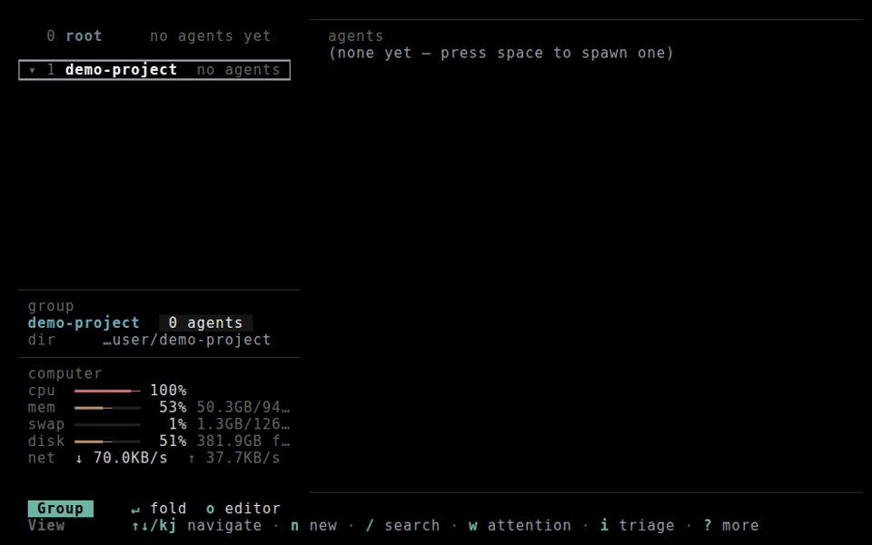
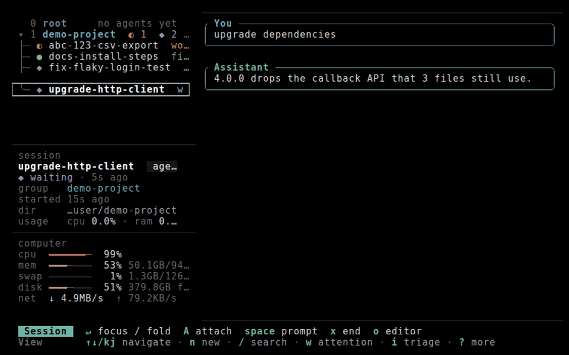
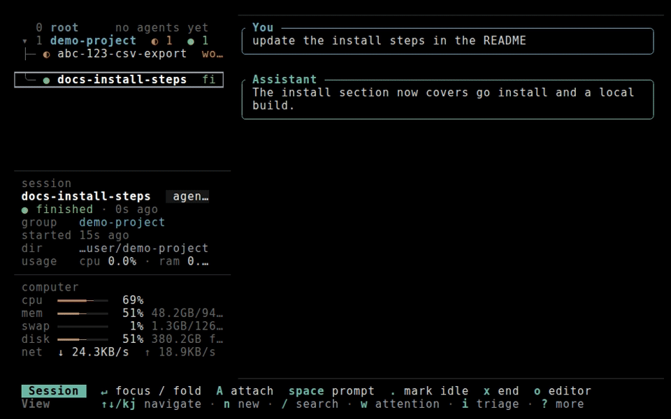

<!-- Modified by Durable Alpha, 2026: changes from the upstream commit named in NOTICE. -->

<p align="center">
  <picture>
    <source media="(prefers-color-scheme: dark)" srcset="docs/brand/wordmark-dark.svg">
    
  </picture>
</p>

<p align="center">
  A terminal board for running and triaging many AI coding-agent sessions in tmux.
</p>



<p align="center"><em>Spawn two agents, watch their status, answer the waiting one from the triage queue, and it hands over the next.</em></p>

Gate Inbox puts every coding agent on your machine in one list with live status, so the session
that is blocked on you is visible without hunting through terminal tabs. Claude Code, Codex and
OpenCode v2 work out of the box and run side by side, each in its own tmux session. Any other CLI
can be added as a `[tools.<name>]` block in the config.

It is a thin layer over the CLIs you already have. Each session launches your installed tool as-is,
so your login, config files, MCP servers and every feature the tool ships carry over unchanged.
Gate Inbox reads the panes; it does not sit between you and the model.

## Your first 5 minutes

1. **Install.** You need tmux 3.1+, git and at least one agent CLI (Claude Code, Codex or
   OpenCode). Then run `go install github.com/usestring/gate-inbox@latest`, or see
   [Install](#install) below.
2. **Start it.** Run `gate-inbox`, inside tmux or outside it. The welcome card lists which of your
   agent CLIs are ready, the five keys that matter, and any agents you already have running in
   tmux. `n` on the card starts your first session.
3. **Agents you already had.** Anything you started by hand in tmux shows up on the board as-is.
   The next card asks whether to keep each one that way, relaunch it into the board, or leave it
   out, and it lists what a pane kept as-is misses ([below](#kept-as-is-or-relaunched)). `N` makes
   that answer the default and stops the question; settings (`s`) turns it back on.
4. **The loop.** `n` starts an agent, `enter` focuses it, `ctrl+q` comes back to the list, `i`
   walks everything waiting on you, and `H` shows every key.
5. **Leaving and coming back.** `q` quits and the agents keep running. When you start it again,
   the board offers back only the sessions that *died* (a reboot, tmux restarting, a crash),
   never the ones you ended yourself. [Stop using it](#stop-using-it) covers stopping for good.

### Kept as-is or relaunched?

| An agent pane you started by hand, kept as-is... | Relaunched into the board, it... |
|---|---|
| keeps running where it is, in its own window | is ended once idle and resumed on the same conversation as a board session |
| has none of the board's MCP tools (spawn, message, tasks) | gets them |
| can't be reached by other sessions or the CLI (`send`, `read`, `answer`, `wait`, `kill`) | can be |
| gets no guaranteed hook status: questions and permission prompts are read off the screen | reports status through Claude Code's hooks |
| lacks the `GATE_INBOX_*` environment, extension settings and a fresh account token | gets all three |
| can't be forked, migrated, restarted or revived without a conversation id | can, on its own conversation |
| doesn't get the back-to-board keys or the pane's title and colours | gets them |
| keeps the flags and `--model` it was started with | is started from your config, so it doesn't keep them |

## Install

Gate Inbox runs on Linux and macOS, and on Windows inside WSL2. It needs **tmux 3.1+** and **git**
on `PATH`, plus at least one agent CLI. Building needs **Go 1.26.5+**.

```bash
git clone https://github.com/usestring/gate-inbox.git
cd gate-inbox
go build -o gate-inbox .
```

Or `go install github.com/usestring/gate-inbox@latest`, which puts `gate-inbox` in
`$(go env GOPATH)/bin`. [`docs/install.md`](docs/install.md) covers optional dependencies, WSL and
updating.

## Quick start

```bash
gate-inbox
```

1. `n` starts an agent in the group under the cursor and focuses it. Type the task.
2. `ctrl+q` goes back to the list. Each row shows its status as the agent works.
3. `i` opens the triage queue, starting with the session that has waited longest.
4. Answer it. The queue hands you the next one.
5. `H` shows every key for the current screen, and `s` opens settings.

Sessions live in tmux, so quitting the board leaves them running. Start `gate-inbox` again and it
picks them back up.

## The core loop

**Spawn.** `n` starts a session in the selected group. `ctrl+n` opens the full form (tool, name,
directory, first prompt, group). `space` on a group spawns an agent on a prompt without opening
it. Agents name their own sessions after the task.

**See status.** Every row shows whether its agent is working, waiting on you, finished or idle,
read from the pane itself. The preview beside the list shows the conversation as **You** and
**Assistant** messages, without the tool noise. `w` filters the list to what needs attention, and
`/` searches names, groups, statuses and what the sessions have said.

**Triage.** `i` flattens the groups into one queue ordered by what needs a person: waiting first,
then errored, then finished, longest-blocked first inside each. Picking an option in a dialog, or
sending a reply, hands that session back to its agent and opens the next one. `ctrl+q` moves on
without answering, and `ctrl+\` stops triage. `G` is the same drain full-width, with the list put
away until the queue is empty; `f2` switches it between the conversation and the terminal.



<p align="center"><em>The <code>G</code> gate: triage full-width with auto-proceed. Answer one session and the next that needs you comes up on its own.</em></p>

**Focus.** `enter` focuses a session in place: keys go to the agent while the list stays beside
it, and `ctrl+q` comes back. `alt+\` hides the list so the pane gets the full width, and
`alt+pgup` / `alt+end` scroll back through its output and return to the live bottom. `space`
sends a prompt to the selected session without focusing it. `T` opens a shell tab under the
selected agent for builds and one-off commands.



<p align="center"><em>Focus a session, give it the full width, type a multi-line instruction, scroll back through the reply, and <code>ctrl+q</code> out.</em></p>

| Key | Action |
|-----|--------|
| `n` / `ctrl+n` | New session, quick or with the full form |
| `space` | Prompt the selected session, or spawn one in the selected group |
| `enter` | Focus the session; `ctrl+q` returns to the list |
| `i` / `G` | Triage queue / full-width drain |
| `w` | Show only what needs attention |
| `/` | Fuzzy search; `esc` clears it |
| `p` | Priority tier for a session or group; higher tiers go first in triage |
| `T` | Shell tab under the selected agent |
| `x` / `v` | End a session to free its RAM / revive it on its own conversation |
| `f` | Fork the conversation into a new session |
| `H` / `s` | Key map for the current screen / settings |

Every binding is a default, and `H` is where you rebind one. [`docs/usage.md`](docs/usage.md) is
the complete reference.

## Agents working with agents

Every MCP-capable session launches with the Gate Inbox MCP server, so an agent can list the other
sessions, spawn a child, send it a message, read its screen and wait for it to finish. The same
actions are `gate-inbox` subcommands for a shell inside any session (`gate-inbox help`). A spawned
child is drawn under its parent, and its questions go to the parent first.

## Configuration

Config lives at `~/.config/gate-inbox/config.toml` on Linux and
`~/Library/Application Support/gate-inbox/config.toml` on macOS, and is created on first run.
`GATE_INBOX_HOME` points the board at another directory, which then holds the config, the
`state.db` store and the logs.

Adding a CLI takes a tool block with the patterns its pane shows in each state:

```toml
[tools.mytool]
command = "mytool"
default_status = "idle"
rules = [
  { state = "waiting", pattern = "(?m)^\\s*❯\\s+\\d+\\." },
  { state = "working", pattern = "esc to interrupt" },
]
```

Sessions run on tmux's default server as `gi_*` sessions, and the board never changes a
server-global option. Set `tmux_socket` to keep them on a server of their own.
[`docs/configuration.md`](docs/configuration.md) covers every field: status detection, revive and
fork commands, prompts and MCP registration.

## Optional integrations

Both are opt-in and talk only to services you run or already use.

**Pull requests and tickets.** Gate Inbox finds the pull requests and tickets a session is working
on from its branch and its output, and hangs them under the session with their CI and review state.
GitHub goes through your logged-in `gh` CLI; Linear reads `LINEAR_API_KEY` from the environment.
A missing credential is not a failure: without `LINEAR_API_KEY` tickets are still listed, just
without their state. Either source can be turned off outright, which hides its rows:

```toml
[integrations.github]
enabled = false

[integrations.linear]
enabled = false
```

**Artifacts.** An extension that lets agents publish a report or an HTML page and hand back a link
that opens from any session, whichever CLI it runs. It is off until you enable it, and the store
behind it is a Cloudflare Worker you deploy yourself; see
[`extension/artifacts/worker/README.md`](extension/artifacts/worker/README.md).

```toml
[extensions.artifacts]
enabled = true
```

Extensions are Go code compiled into the binary against the public `extension` package; the `app`
package runs the board with whichever extensions a build carries. A build of your own lists its
extensions in `app.Options`, and carries the artifacts one by listing `artifacts.New()` from
`extension/artifacts`. A section an extension refuses switches off that extension alone, and a
section no extension in the build owns is ignored; the board's `?` key map and each session's MCP
instructions say which and why. A disabled extension that has a say in
which sessions spawn fails closed: every spawn it would have been asked about is refused, with the
reason, until its section is fixed.

## Development

```bash
go build -o gate-inbox .
CGO_ENABLED=0 go test ./...
```

[`CONTRIBUTING.md`](CONTRIBUTING.md) covers sending a change, and [`SECURITY.md`](SECURITY.md) how
to report a vulnerability privately. The recordings above come from `tools/demo/record.sh`, which
drives [vhs](https://github.com/charmbracelet/vhs) against a throwaway board whose sessions run a
scripted stand-in CLI, so no model or account is involved.

## License and provenance

[Apache-2.0](LICENSE). Gate Inbox is derived from an Apache-2.0 upstream project, where its
session model, tmux passthrough and TUI began. [`NOTICE`](NOTICE) names that project, its authors
and the commit this fork started from. [`LICENSES/MODIFIED-FILES.txt`](LICENSES/MODIFIED-FILES.txt)
lists the files changed since, and [`LICENSES/THIRD-PARTY.md`](LICENSES/THIRD-PARTY.md) covers
third-party licences.

## Stop using it

**Quit.** `q` quits the board. Its agents keep running in tmux as `gi_<id>` sessions and are
picked back up next time.

**Stop every agent.** `gate-inbox park` ends every live agent the board started and records the
set. It runs from any shell, and `--dry-run` prints the plan first. `gate-inbox unpark` brings
the same sessions back on their conversations. A single one: `gate-inbox kill <id>`, with the id
from `gate-inbox sessions`.

**Carry on in the plain CLI.** In a focused session, `alt+y` copies the agent's own conversation
id. From that session's working directory:

| CLI | Resume |
|---|---|
| Claude Code | `claude --resume <id>` |
| Codex | `codex resume <id>` |
| OpenCode | `opencode --session <id>` |

Without an id, `claude --continue`, `codex resume --last` and `opencode --continue` pick up the
directory's most recent conversation.

**Uninstall.**

1. `gate-inbox park`, then quit the board with `q`.
2. Remove the binary: `rm "$(command -v gate-inbox)"`.
3. Remove the config and state directory. That's `$GATE_INBOX_HOME` if you set it, otherwise
   `~/.config/gate-inbox` on Linux (`$XDG_CONFIG_HOME/gate-inbox` if that's set) and
   `~/Library/Application Support/gate-inbox` on macOS. It holds `config.toml`, `state.db`, the
   log, key bindings, snippets, hook and MCP registration files, and a copy of the binary under
   `bin/`.
4. Remove the launch scripts and pasted images it left in your temp directory:
   `rm -f "${TMPDIR:-/tmp}"/gi-launch-*.sh` and `rm -rf "${TMPDIR:-/tmp}/gate-inbox-pastes"`.
5. Undo the tmux key bindings it added (`ctrl+q`, `ctrl+\` and `alt+o`, which act only inside
   `gi_*` sessions): `tmux unbind-key -n C-q \; unbind-key -n 'C-\' \; unbind-key -n M-o`, or
   restart tmux. If the board didn't exit cleanly, `tmux kill-session -t gi_poll-anchor` removes
   its helper session. If you gave it a private tmux socket, `tmux -L <name> kill-server` does
   all of this at once.

Gate Inbox writes nothing to your agent CLIs' own configuration. It hands each session its MCP
server and hooks on the command line. The one exception is `migrate`, which leaves a
`*.handover.jsonl` file next to the transcript it moved, under `~/.claude/projects` or
`~/.codex/sessions`.

## Credits

Gate Inbox is derived from [agent-manager](https://github.com/YoanWai/agent-manager), licensed
under Apache-2.0. Thank you to Yoan Wai and the agent-manager contributors for the session model,
tmux passthrough and TUI this project grew from. [`NOTICE`](NOTICE) carries the attribution and
the upstream commit this fork started from.
